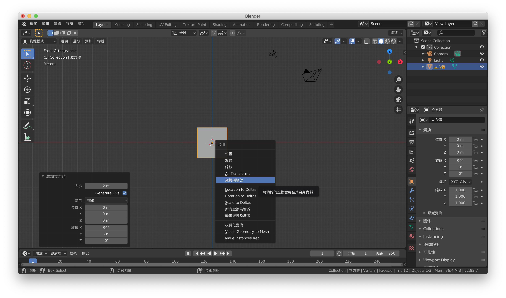
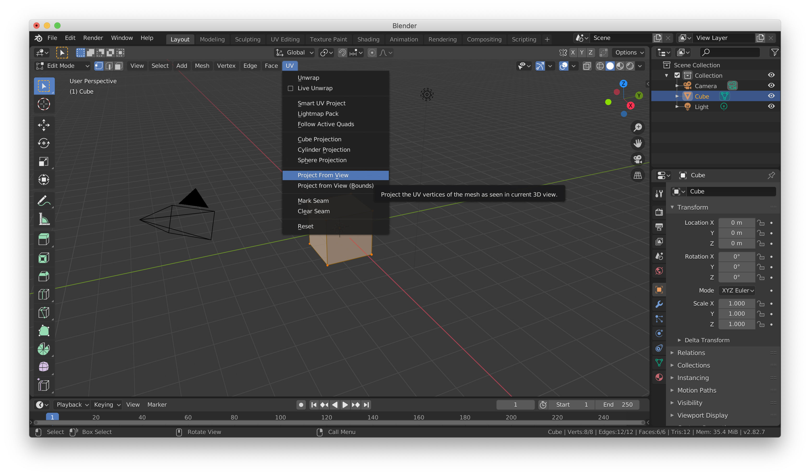
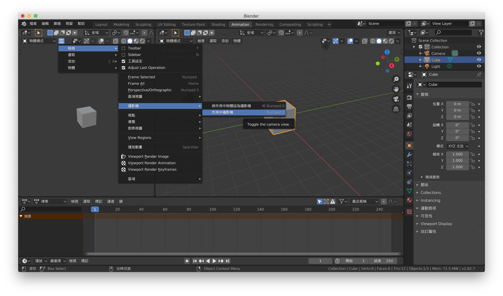
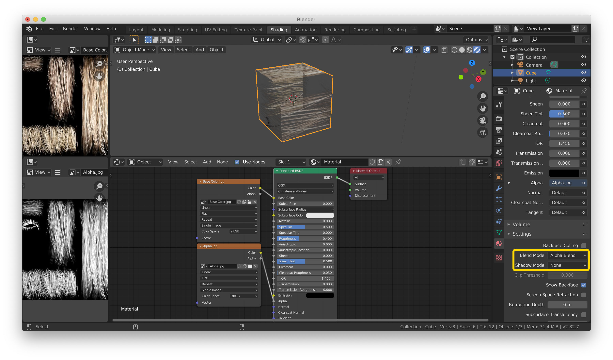
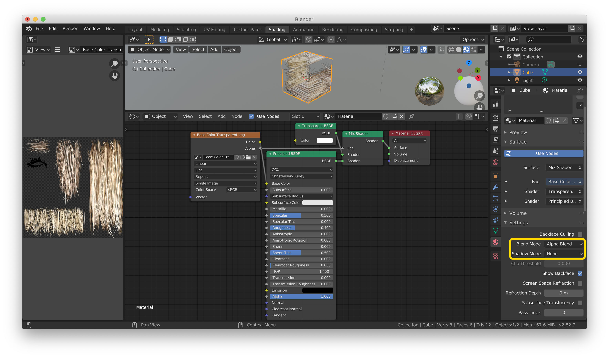
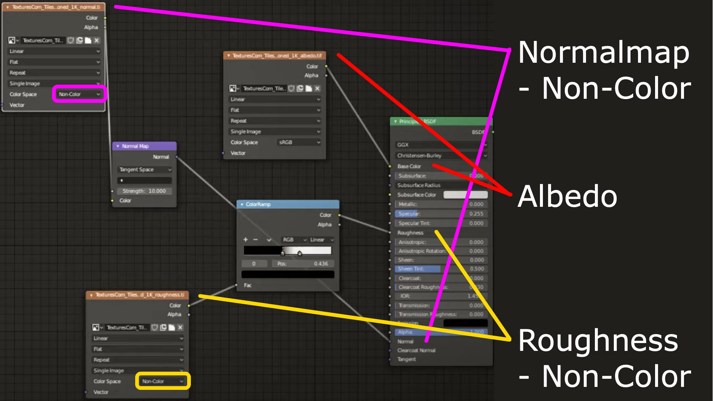
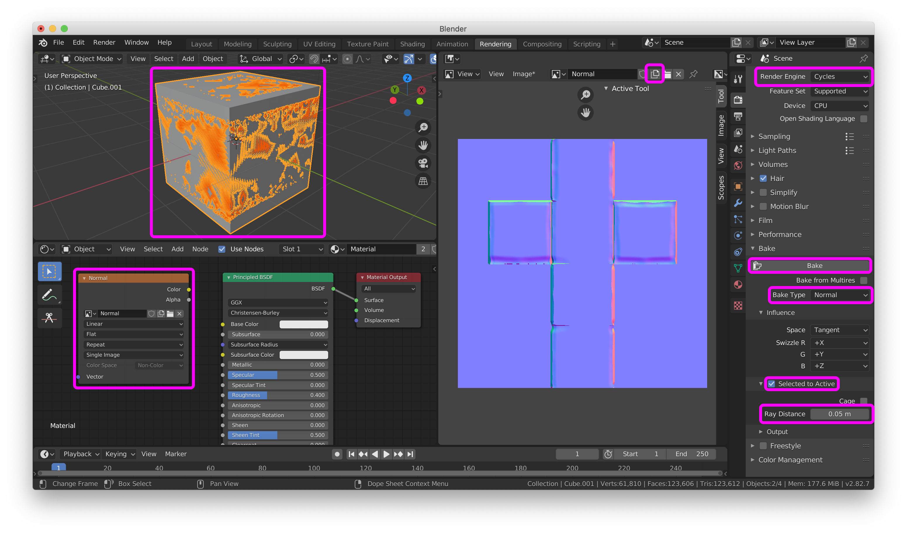
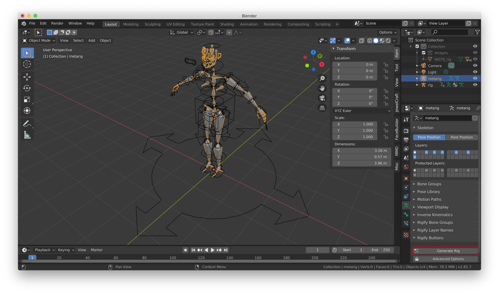

# blender
Blender 2.8.2 macOS

# 附加元件 Add-ons
- Copy Attributes Menu (Add-ons Search "Interface:Copy Attributes Menu")
- LoopTools (Add-ons Search "Mesh:LoopTools")
- [JewelCraft](https://github.com/mrachinskiy/jewelcraft)
- [Offset Edges](https://blenderartists.org/t/offset-edges/584283)
- Rigify (Add-ons Search "Rigging:Rigify")
- [MMD Tools](https://github.com/powroupi/blender_mmd_tools/tree/dev_test) 
(使用時先解壓縮檔案，之後壓縮資料夾內的 mmd_tools ，最後在 Blender 安裝壓縮後的 mmd_tools ，如 Enable 時出現錯誤，請重啟 Blender 并重試 Enable)

# 數位板 Pen Tablets
Wacom Intuos
```bash
Pen settings
# 滑動工具列及畫面
- Middle Click
# 打開選單，編輯模式下選單有部分的Add-ons
- Right Click
```

# 物體模式 Object Mode
```bash
# 選取類
全選 A
轉換模式 Tab
移動畫面 Shift(按住) + Middle click
縮放畫面 Ctrl(按住) + Middle click
調整角度 Middle click
屬性面板(項目/工具/檢視) N
隱藏 H
僅顯示物體 /
轉換線框顯示 Shift + Z
選取顯示方式 Z
# 工具類
細分 Ctrl + 0-５(算繪等級)
增加物體 Shift + A
復製 Shift + D
復製選單 Ctrl + C
# 骨架類
使用自動權重 Ctrl + P
# 通用類
旋轉與縮放 Ctrl + A - 旋轉與縮放
鎖定移動 (按下移動類型鍵後適用)X/Y/Z
游標選項 Shift + S
```

# 編輯模式 Edit Mode
```bash
# 選取類
選取鼠標位置的物體 L
全選 A
選取連結項 Command + L
反選 Ctrl + I
增加選取 Shift(按住)
減少選取 Ctrl(按住)
選取連結線 Option(按住)
移動選取 C(esc為離開，按住Shift為減小選取)
移動時吸附 Ctrl(移動時按住)
# 工具類
移動 G
線上移動 G + G
旋轉 F
縮放 S
擠出 E
向外擠出 E + S
旋轉 R
復製 Shift + D
建立面 F
圈切 Ctrl + R
倒角 Command + B
刪除選單 X
格線填入 Ctrl + F - 格線填入
擠出選單 Option + E
面選單 Ctrl + F
分離選單 P
停止Knife Space
縮放曲線 Option + S
旋轉曲線 Command + T
# 骨架類
保持偏移 Ctrl + P - 保持偏移
解除關係 Option + P - 解除關係
```

# 雕塑模式 Sculpt Mode
```bash
調整力度 Shift + F
```

# 姿勢模式
```bash
反轉運動學(IK) Shift + I
重置旋轉 Option + R
重置位置 Option + G
重置大小 Option + S
```

# Modifier Properties
陣列
- 復製物體

鏡象
- 對稱復製物體

細分
- 增加物體點線面, 變圓

布林 Boolean
- 聯集 Union 結合兩個物體沒有重疊部份
- 差集 Difference 減掉兩個物體重疊部份
- 交集 Intersect 產生兩個物體重疊部份

實體化
- 增加物體厚度, 偏移數值正負為向內或向外

重設網格 Remesh
- 減少多個物體結合產生的連接痕跡

# Issues
Blender ^2.8.3 中文化字體消失或殘缺問題？
- 下載 [Blender 2.8.2](https://download.blender.org/release/Blender2.82/)

使用陣列或鏡象時，物體尺寸錯誤？
- 套用旋轉與縮放 Ctrl + A - 旋轉與縮放


快捷鍵失效？
- 關閉倉頡或速成

匯出 glTF 2.0 (.glb/.gltf) 時，缺失顏色或材質？
- Material Properties - 使用節點 - 表面 Principled BSDF
- 匯出時 - 幾何 - 材質

使用 LoopTools Bridge 連接面時無效？
- 先在物體模式結合 - 編輯模式選取打算連接的點 - 右鍵物體 - LoopTools - Bridge

匯出 glTF 2.0 (.glb/.gltf) 時，缺失粒子設定(毛髮)？
- Modifier Properties - 粒子設定 - 轉變 - 物體模式選取新增的Mesh - 物體 - 轉換為 - 來自網絡/文字的曲線 - 選取Mesh - Object Data Properties - 選取3D，填補方式為前，倒角深度為0.005 - 物體模式選取Mesh - 物體 - 轉換為 - 來自曲線/變幻/表面/文字的網絡

如何生成毛髮(粒子設定)？
- 編輯模式內選取打算生成毛髮的點 - Object Data Properties - 增加頂點群組 - 指派 - Particle Properties - 增加粒子設定 - 選取毛髮，發射內設定毛髮數量及長度，頂點群組的密度選取之前增加的頂點群組
- 粒子編輯模式內可調整毛髮

如何使用圖片為材質？
- Material Properties - 增加材質 - 基礎色彩 - 影像紋理 - 開啟 - 選擇圖片 - 編輯模式內選取物體 - UV - 智慧 UV 投影
- Material Properties - 增加材質 - 基礎色彩 - 影像紋理 - 開啟 - 選擇圖片 - 編輯模式內選取物體 - UV - 投影從視圖


如何使用親子關係復製物體？
- Object Properties(子物體) - 關係 - 親子選取父物體 - Object Properties(父物體) - Instancing - 選取點或面 - Ctrl + A - Make Instances Real

如何連接骨架和物體？
- 選取物體 - 按住Shift選取骨架 - Ctrl + P - 使用自動權重

實體化時物體部份變形或方向錯誤？
- 選取變形位置的點 - 網格 - 法線 - Flip

如何在兩點之間增加點？
- 選取兩點 - 編輯模式 - 邊線 - 細分

如何在物體增加點？
- 選取物體 - 編輯模式 - 邊線 - 細分

如何在鏡象時移動至鏡象的中心點？
- 選取點 - G - 移動時鎖定鏡象使用的軸(X/Y/Z) - 移動時按住Ctrl - 移動至中心點會自動吸附至正確的中心點
- 鏡象 - 選項 - 剪輯(中間線多出部份會被自動切除)

如何縫製衣服？
- 連接需要縫製的點(多個點時用 LoopTools Bridge - X - 僅面) - Physics Properties - 布料 - 外型 - Sewing - 物體模式下按播放動畫 - Modifier Properties - 套用
- 如有模型作碰撞面 - 物體模式下選取模型 - Physics Properties - 碰撞

如何生成人體骨架？
- Add-ons 內 Rigging：Rigify 為啟動 - 物體模式下 Shift + A - 骨架 - Human(Meta-Rig)

如何為物體的部份面上參考色?
- Material Properties - + - 新增 - Viewport Display - 顏色 - 編輯模式下選取打算上色的面 - 指派

如何生成髮片？
- 生成髮片主體 - 曲線 - 路徑 - 生成髮片外型 - 曲線 - 貝茲/圓 - 選取路徑 - Object Data Properties - 幾何 - 倒角 - 物體選取貝茲/圓
- 窄縮物體為髮片兩端
- 髮片外型曲線內可增加多個曲線，髮片主體曲線上也會生成
- 髮片外型曲線中間的點為髮片主體曲線的位置

如何增加/關閉 Areas (窗口)？
- 移動至左上(編輯器類型的左邊)或右上(選項的右邊)直至出現＋號，按下拉動出現新的Areas
- 兩個Areas之間按右鍵 - Join Areas - 選擇為主的Areas按下左鍵

如何透明化 Reference ？
- Object Data Properties - 透明 - 不透明度

如何分離結合後的物體？
- 編輯模式下選取打算分離的物體其中一點 - L - 右鍵 - 分離 - 選取項

粒子編輯下所有功能鍵沒反應？
- N - 工具 - 選項 - Editing Type - 粒子

使用自動權重時出現"骨頭熱權重:無法找出一根或多根骨頭"的錯誤?
- 建議在物體套用細分表面前完成，細分表面後進行自動權重容易發生錯誤
- 切開物體，并逐一使用自動權重，來找出造成自動權重失敗的部份，多數發生於部分物體太細或太薄

做動畫時新動作覆蓋了之前動作？
- 每次都按 A - I - 位旋

如何傳輸身體權重到衣服？
- 連接骨架和衣服 - 使用空白群組 - 選取身體 - 按住 command 選取衣服 - 權重繪製 - 權重 - 傳輸權重 - 頂點映射選取最近面頂點 - Source Layers Selection 選取依名稱

如何防止穿模？
- 選取身體 - 新增頂點群組 - 選取容易穿模的點 - 指派 - Modifier Properties - 遮罩 - 頂點群組選取之前新增的 - 按下右邊的反轉(<->)

如何在 Animation 頁面開啟攝影機預覽畫面？
- 檢視 - 攝影機 - 作用中攝影機


如何使用 Texture 做出透明背景的材質(例如頭髮，樹葉等)？
- Texture 為一張原色和一張黑白圖片(參考圖中左邊)

- Texture 為一張背景透明的原色圖片(參考圖中左邊)


如何使用 Texture 中的 Albedo，Normalmap 和 Roughness ？
- Albedo(Color, C, A)，Normalmap(N)，Roughness(R)


如何生成 Texture Normal (主要作用於把高模的精細部分套用到低模的表面上)？
- 先選取高模後選取低模 - 生成新圖片(建議為4096x4096) - 在材質畫面生成 Image Texture 并使用之前的新圖片 - Render Engine 選取 Cycles - Bake Type 選取 Normal - 開啟 Selected to Active - 按下 Bake (如效果不佳可以調整 Ray Distance 值)


使用 Render 後模型圖片顏色出現格線？
- 選取出現格線的物體 - Object - Shade Smooth

如何複製骨架動作至另一個骨架？
- 先選取被覆蓋的骨架 - 按住 command 選取複製的骨架 - Ctrl + L - Animation Data(會完全覆蓋)
- 先選取被複製動作的骨架 - Pose Mode - 選取動作 - Ctrl + C - Object Mode - 選取另一個骨架 - Pose Mode - Ctrl + V

如何生成 Rigify ？
- 圖中使用附加元件 "Rigging:Rigify" 生成骨架 - 調整所有骨架至模型的對應位置 - 按下 Generate Rig 生成 rig - 選取物體 - 按住Shift選取之前生成的 rig - Ctrl + P - 使用自動權重


# References
- [Blender 2.83 參考手冊](https://docs.blender.org/manual/zh-hans/latest/) - Blender 功能介紹的網站

- [Free 3D Models | CGTrader](https://free3d.com/zh/3d-models/) - 提供模型下載的網站

- [ニコニ立体](https://3d.nicovideo.jp/) - MMD 模型下載的網站

- [3DAssets.one - the 3d asset search engine](https://www.3dassets.one/) - 提供紋理下載的網站

- [Textures for 3D, graphic design and Photoshop!](https://www.textures.com/) - 提供紋理下載的網站

- [Mixamo](https://www.mixamo.com/#/) - 提供上傳模型進行骨架和動畫綁定的網站

- [匯出動畫教學](https://youtu.be/5xOeeP4bjuo) - 從 Blender 中匯出動畫的過程影片

- [FacialMotionCapture](https://github.com/srleohung/FacialMotionCapture) - Real-time facial motion capture in Blender 2.8 using OpenCV and a webcam. This uses python scripting directly in Blender.