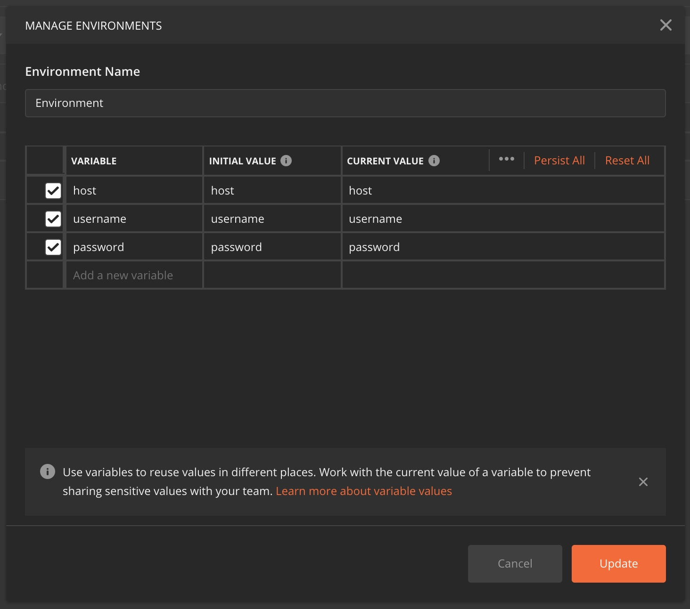

# postman

## Obtain token automatically for the request
- URL (Use environment value to set URL)

    `{{host}}`/api/transaction/

- Headers (Use pre-request script values to set headers)

    KEY|VALUE
    ---------------|---------------
    Authorization|`{{authorization}}`

- Pre-request Script

    ```javascript
    // Send request to get token
    pm.sendRequest({
        url: pm.environment.get('host') + '/api/authorization/',
        method: 'POST',
        header: 'Content-Type:application/json',
        body: {
            mode: 'raw',
            raw: JSON.stringify({
                "username": pm.environment.get('username'),
                "password": pm.environment.get('password')
            })
        }
    }, function (err, response) {
        // Set the token as a variable
        pm.variables.set('authorization', "Bearer " + response.json().token)
    });
    ```

- Environment (Set environment value)

    